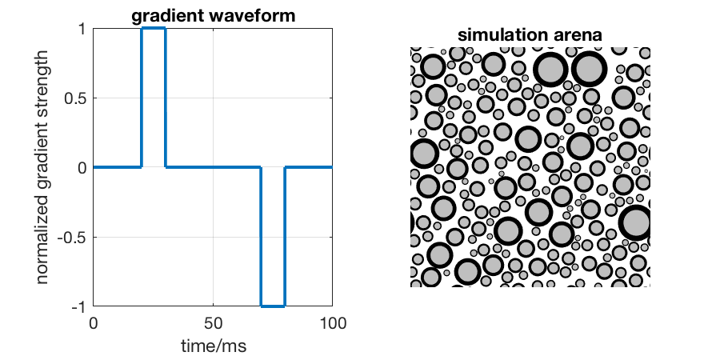
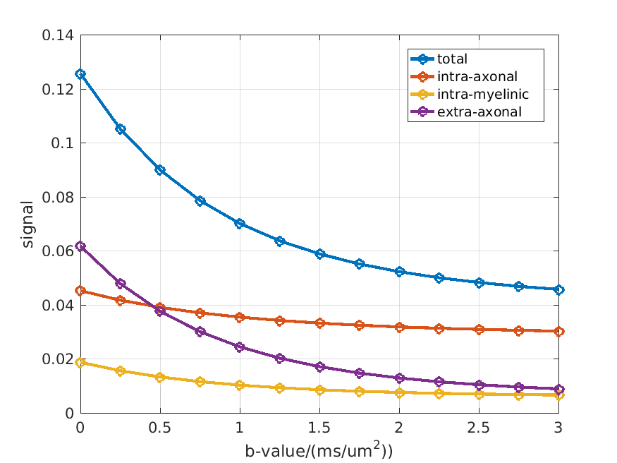

# MC-DWI — Monte Carlo simulations of diffusion MRI

This is a toolbox for 2D simulations of diffusion-weighted signal in white matter. Diffusion-weighted signal can be simulated for any diffusion-weighted waveform in a direction perpendicular to the orientation of axons. The toolbox includes the flexibility to simulate water diffusion in myelin and water exchange between compartments. 

Written by Kevin Harkins. 

## Getting Started

### Prerequisites

* A recent version of MATLAB
* The parallel computing toolbox
* A CUDA compatible Nvidia GPU

If those prerequisites are setup correctly, the MATLAB command `gpuDevice` should return something like

```
>> gpuDevice

ans = 

  CUDADevice with properties:

                      Name: 'GeForce GTX TITAN'
                     Index: 1
         ComputeCapability: '3.5'
            SupportsDouble: 1
             DriverVersion: 8
            ToolkitVersion: 7.5000
        MaxThreadsPerBlock: 1024
          MaxShmemPerBlock: 49152
        MaxThreadBlockSize: [1024 1024 64]
               MaxGridSize: [2.1475e+09 65535 65535]
                 SIMDWidth: 32
               TotalMemory: 6.3778e+09
           AvailableMemory: 6.1476e+09
       MultiprocessorCount: 14
              ClockRateKHz: 875500
               ComputeMode: 'Default'
      GPUOverlapsTransfers: 1
    KernelExecutionTimeout: 0
          CanMapHostMemory: 1
           DeviceSupported: 1
            DeviceSelected: 1
```

Otherwise, please refer to MATLAB and Nvidia documentation. 

### Installing

Click "download" above, or clone from the command line:

```
git clone git@github.com:kevinharkins/mc-dwi.git
```

## Testing

Two scripts are used to test the simulation. Both create a markdown file where the results can be viewed.

* `test_mc2sim.m` performs specific jump tests related to the physics of the simulation, interaction and boundaries, etc. An example result is included as [TEST_mc2sim.md](TEST_mc2sim.md).
    * Note that because the physics of diffusion in myelin is performed in radial coordinates, some of the results can look unintuitive.
* `test_dwmriWAVE.m` compares simulated diffusion-weighted signals to known analytic approximations. An example result is included as [TEST_dwmriWAVE.md](TEST_dwmriWAVE.md).

## An example simulation

You can find the code for this example in [example.m](example.m)

First, set some simulation parameters and make a pulsed-gradient diffusion waveform,

```matlab
Nspin = 100000; % the number of spins to simulate

te = 100; % experimental echo time, ms
dt = 0.01; % time step, ms

bval = linspace(0,3,13); % ms/um^2, diffusion b-value 
bigDelta = 50; % ms
litDelta = 10; % ms

[Gdiff,t] = makePGwave(dt,te,bigDelta,litDelta);
```

Next, create a simulation arena of axons: 

```matlab
Nax = 200; % number of axons to use in the arena
axf = 0.6; % axon volume fraction
axd = 1.0; % um, arithmetic mean axon diameter of the distribution
sigma = 0.5; % standard deviation of the log-spaced diameters
gratio = 0.7; % axonal g-ratio

% create the arena structure
[parms.xr,parms.yr,parms.ro,parms.Lx] = axonLogNormGen(Nax,axf,axd,sigma);
parms.ri = gratio*parms.ro;
```

and define some tissue parameters:

```matlab
parms.T2 = [15 80]; % T2 in myelin and non-myelin compartments, ms

% [Dmr Dmc Die], the "free" diffusion coefficients in myelin (in the radial 
% and circumferential direction) and non-myelin compartments
parms.D = [0.001 3.0 3.0]; % um^2/ms 

% ratio of the spin density in myelin to intra/extra-axonal space
parms.M0r = 0.5; 
```

The function `plotDist` can be used to display the simulation arenas. The waveform and simulation arena should look something like this:


Note that the signal in myelin and compartmental water exchange can be neglected by setting `parms.M0r=0.0;`

Finally, run the simulation:

```matlab
parms.dt = dt;
parms.N = Nspin;
[sig,isig,msig,esig] = dwmriWAVE(parms,Gdiff,bval);
```

Example simulated signals are shown below:


## File list

* Matlab files for simulation
    * `dwmriWAVE.m` — the primary entry point for the simulation.
    * `mc2sim.m` — a wrapper for CUDA simulation code. This function is used by `dwmriWAVE.m` to perform the simulation calculations.
    * `example.m` — performs an example simulation
* Matlab files that can be used to generate simulation arenas
    * `axonDeltaGen.m` — creates an arena with axons of constant diameter
    * `axonGammaGen.m` — creates an arena with axon diameters drawn from a gamma distribution
    * `axonLogNormGen.m` — creates an arena with axon diameters drawn from a log-normal distribution
* Other Matlab files
    * `plotDist.m` — useful to display simulation arenas to the current axis in MATLAB
    * `axonSeed.m` — used by `dwmriWAVE.m` to randomly seed spins into the arena proportional to compartment spin density
    * `axonSeed_ext.m` — used by test scripts to randomly seed spins only into extra-axonal space
    * `GxtoB.m` — calculates the b-value from a diffusion waveform
* CUDA files in the `cu` folder
    * `mc2.cu`, `mc2.ptx` — contains the CUDA kernel for calculating a single timestep of the Monte Carlo simulation
    * `mcSeed.cu`, `mcSeed.ptx` — contains the CUDA kernel for seeding spins into a geometry proportional to the spin density 
    * `mcSeed_ext.cu`, `mcSeed_ext.ptx` — contains the CUDA kernel for seeding spins into the extra-axonal space of a geometry
* Markdown files:
    * `README.md` — this file
    * `TEST_dwmriWAVE.md` — an example output from the test script `test_dwmriWAVE.m`
    * `TEST_mc2sim.md` — an example output from the test script `test_mc2sim.m`

## License

This project is licensed under xxxx

## Acknowledgments

Development of this toolbox has been supported by NIH grants EB001744 and EB019980. 

## References

Some version of this toolbox has been used in the following publications: 

1. Harkins KD, Does MD. Simulations on the influence of myelin water in diffusion-weighted imaging. Phys Med Biol. 2016;61(13):4729–45. 
2. Tétreault P, Harkins KD, Baron CA, Stobbe R, Does MD, Beaulieu C. Diffusion time dependency along the human corpus callosum and exploration of age and sex differences as assessed by oscillating gradient spin-echo diffusion tensor imaging. Neuroimage. 2020 Apr;210(January):116533. 
3. More coming soon...