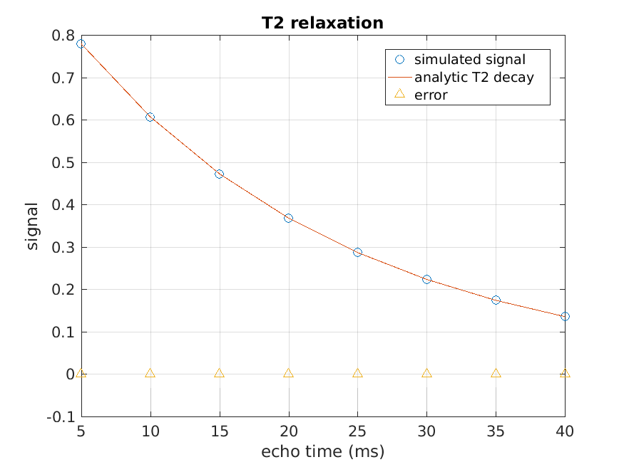
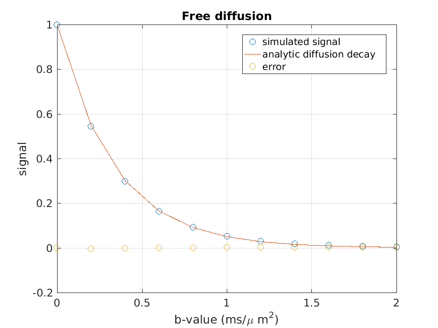
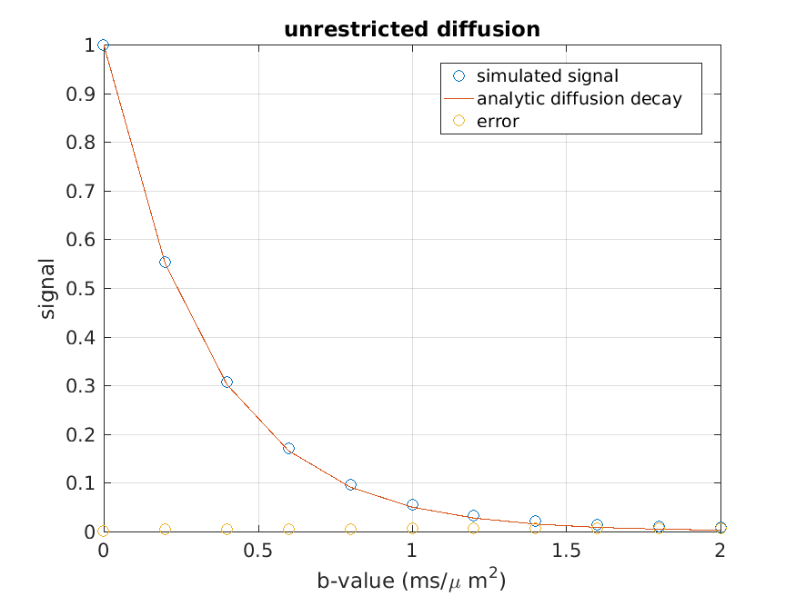
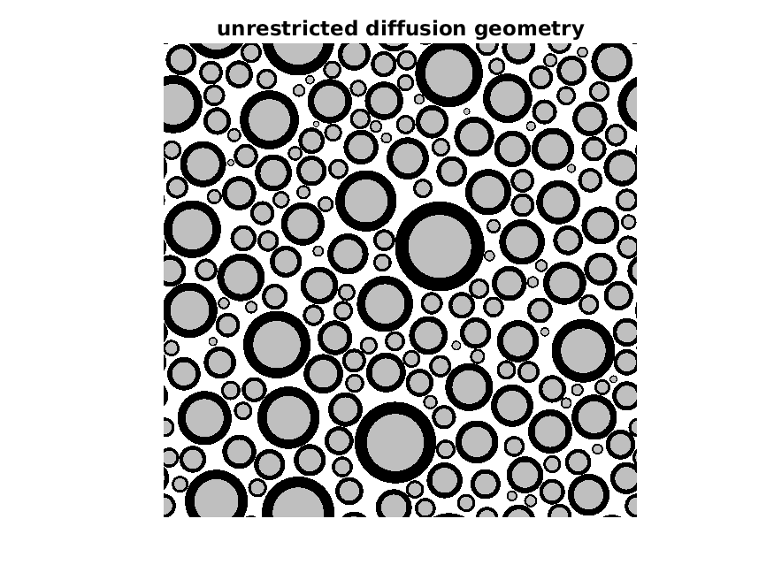
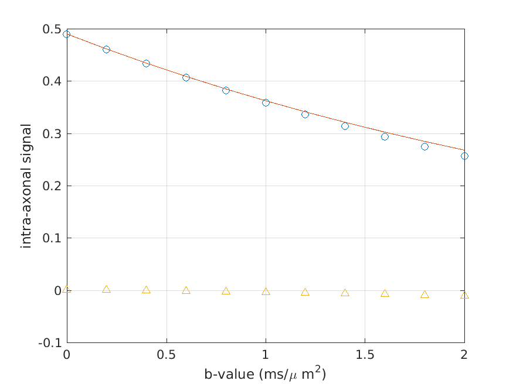

# Testing `dwmriWAVE.m`

Run at 21-May-2020 17:30:00

## T2 Relaxation

In this test, 100 000 spins diffuse and relax for up to 50 ms with T2 = 20 ms. The analytic solution is an exponential decay.

RMSE: 6.318477e-05

## Free diffusion in an empty geometry

In this test, 100 000 spins diffuse in an empty arena with bigDelta = 20 ms, littleDelta = 5 ms. Signal vs b-value should match an exponential decay.

RMSE: 7.553959e-03

## Free diffusion in an unrestricted geometry

In this test, 100 000 spins diffuse in an arena of axons that impose no restriction. Signal vs b-value should still match an exponential decay.

RMSE: 1.654958e-02

## Intra-axonal diffusion

In this test, intra-axonal signal is compared to an analytic expression given by van Gelderen & DesPres J Magn 1994.

RMSE: 1.998697e-02

Note: the van Gelderen approximation is only valid for low b*Dapp
