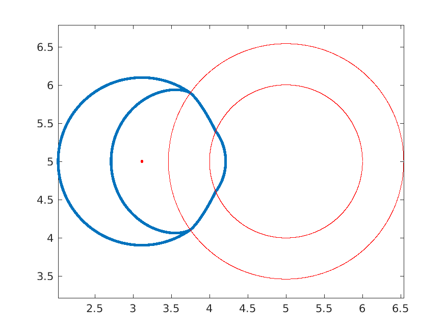
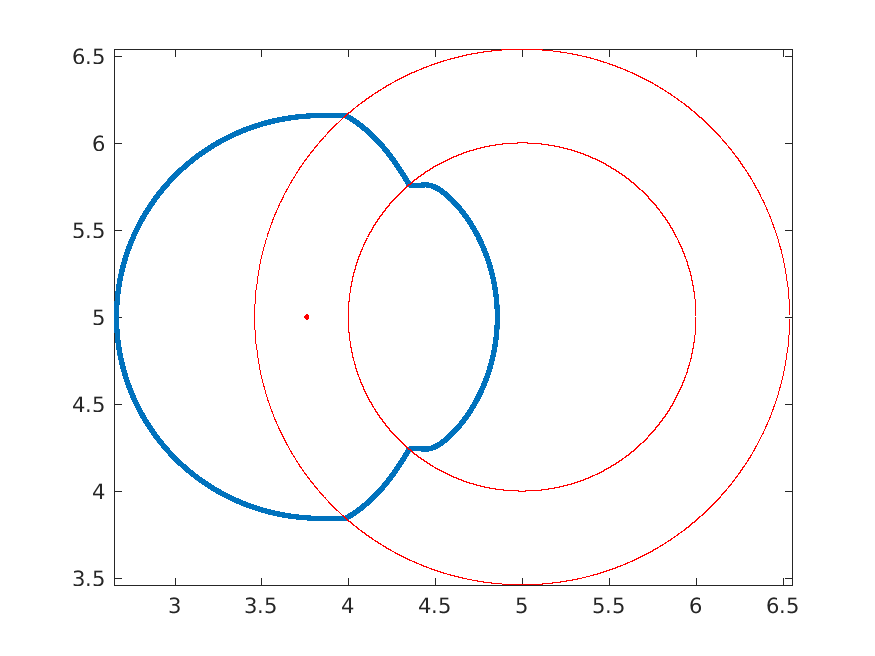
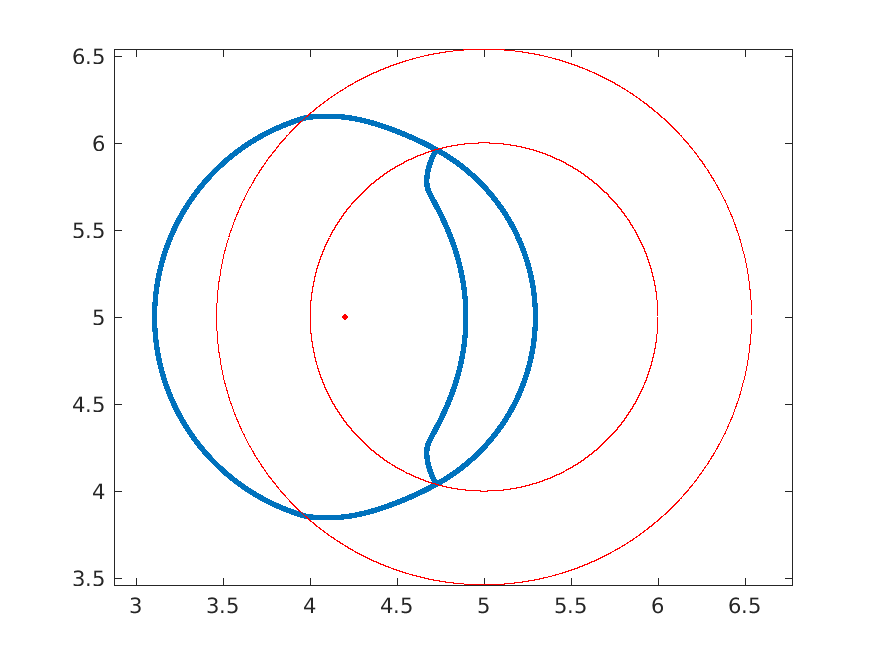
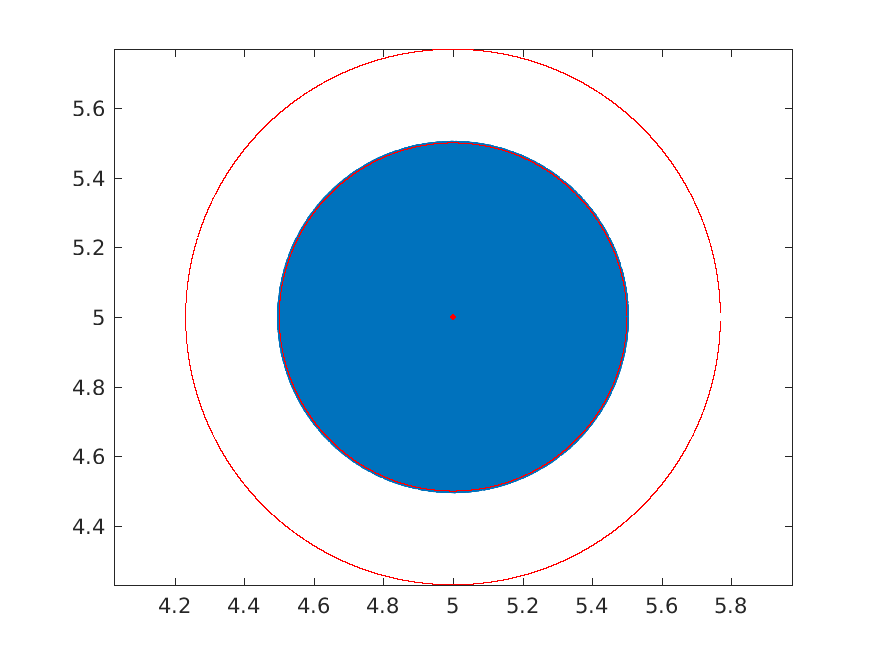
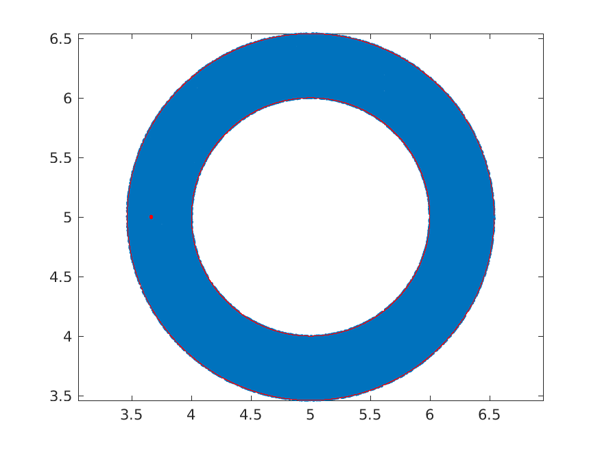
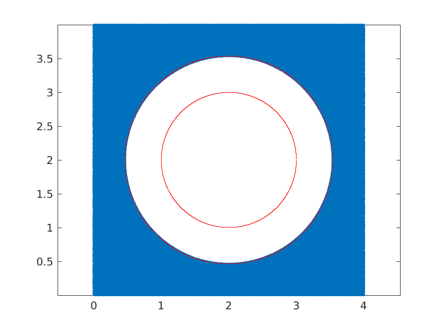
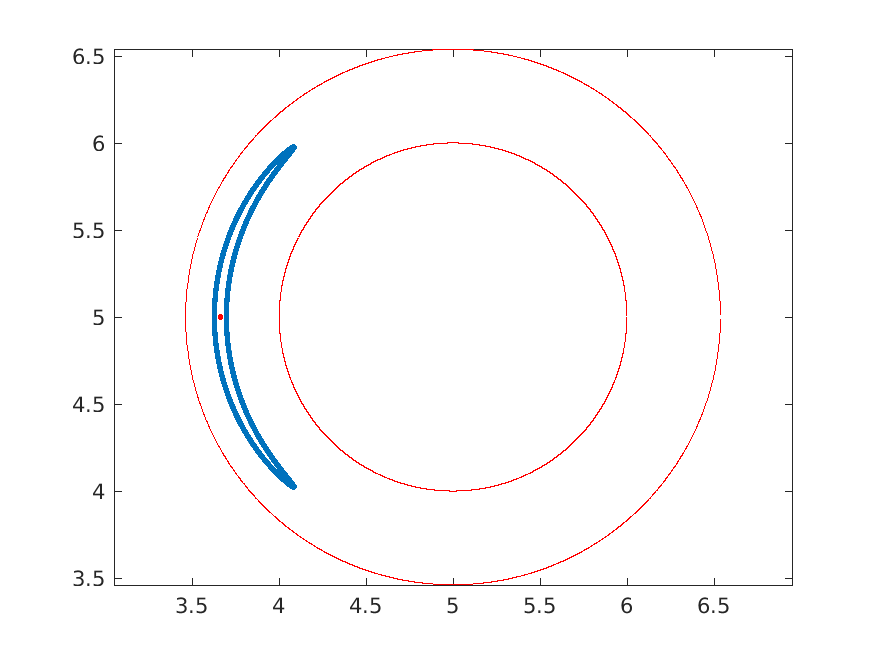

# Testing `mc2sim.m`

Run at 21-May-2020 17:27:28

## Jump test from outside an axon

In this test, 500 000 spins originating from a single point outside an axon jump in a random direction. About half of the spins that interact with the outer boundary should reflect back, and not reflect off the inner boundary.



## Jump test from inside myelin 

In this test, 100 000 spins within a single point inside myelin jump in a random direction. None of the spins should reflect back.



## Jump test from inside an axon 

In this test, 100 000 spins within a single point inside an axon jump in a random direction. About half of the spins that interact with the inner boundary should reflect back, while the spins that interact with the outer boundary should not reflect.



## Intra-axonal restriction

In this test, 500 000 spins diffuse inside an axon for 100 ms. At the end of the simulation, all the spins should still be inside the axon.



## Intra-myelin restriction

In this test, 100 000 spins diffuse inside myelin for 100 ms. At the end of the simulation, all the spins should still be inside myelin.



## Extra-axonal restriction

In this test, 500 000 spins diffuse in extra-axonal space for 100 ms. At the end of the simulation, all the spins should still be outside of the axons.



## Anisotropic diffusion in myelin

In this test, 100 000 spins originating from the same point inside myelin anisotropically jump in a random direction. This should creates a bent ellipse-like shape. 



## Equilibrium of spins in each compartment

In this test, 50 000 spins are seeded throughout a geometry of axons and diffuse for 1 second. At the end of the simulation, the proportion of spins in each space should be approximately the same as the start.
```
intra-axonal: theoretical density: 136.23, resulting density: 138.94
myelin      : theoretical density: 68.12, resulting density: 67.77
extra-axonal: theoretical density: 136.23, resulting density: 136.20
```

